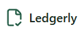
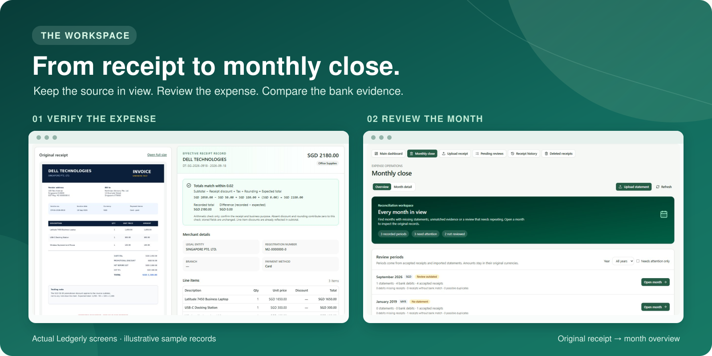

<h1 align="center"></h1>

<p align="center"><strong>A bookkeeping assistant that helps a bookkeeper extract receipt details, classify expenses and compare bank transactions, while keeping a human in the loop for uncertain decisions.</strong></p>

<p align="center">For owner-managed micro and small SMEs with one person handling recurring expense receipts and monthly bank checks, including small retailers, cafés and service businesses.</p>

<p align="center">
  <a href="https://github.com/yipkaio/Ledgerly/actions/workflows/ci.yml"></a>
  <a href="https://github.com/yipkaio/Ledgerly/releases/tag/v0.1.0"></a>
</p>

<p align="center">
  <a href="Dockerfile"></a>
  <a href="pyproject.toml"></a>
  <a href="frontend/package.json"></a>
  <a href="app/database.py"></a>
  <a href="docs/setup.md"></a>
  <a href=".env.example"></a>
  <a href="docs/authentication.md"></a>
  <a href="docs/docker.md"></a>
  <a href="docs/docker.md#lightsail-deployment-and-subsequent-updates"></a>
</p>

<p align="center"><a href="https://github.com/yipkaio/Ledgerly">GitHub repository</a> · <a href="docs/user-guide.md">User guide</a> · <a href="docs/index.md">Documentation index</a></p>



*Actual UI with illustrative sample data. See the [user guide](docs/user-guide.md) for the complete screens and workflows.*

## Contents

- [Overview](#overview)
  - [Why Ledgerly exists](#why-ledgerly-exists)
  - [What Ledgerly does](#what-ledgerly-does)
  - [Who it is for](#who-it-is-for)
- [Get started](#get-started)
  - [Choose an installation path](#choose-an-installation-path)
  - [What you need](#what-you-need)
  - [Local Docker quick start](#local-docker-quick-start)
  - [After installation](#after-installation)
- [Use Ledgerly](#use-ledgerly)
- [Troubleshoot Ledgerly](#troubleshoot-ledgerly)
- [How it works](#how-it-works)
- [Project structure](#project-structure)
- [Documentation and checks](#documentation-and-checks)

## Overview

### Why Ledgerly exists

For a small business, expense records often begin as separate receipts, invoices and bank transactions. A bookkeeper has to read the documents, enter their details, choose consistent expense categories and later compare the records with the bank statement. Repeating those steps takes time, and similar expenses can be classified differently or require correction.

Ledgerly was made to help one bookkeeper handle that work with a clearer trail of evidence. It proposes receipt details and categories, routes uncertain results to human review and keeps the original source alongside recorded decisions for the monthly bank comparison. Reducing manual effort and improving consistency are the goals; measured savings and accuracy still require evaluation.

### What Ledgerly does

- Accepts JPEG, PNG and bounded PDF receipts through the web app, plus receipts from an owner-only Telegram relay.
- Reads receipts locally with OCR, reuses known vendor categories, and requests a category suggestion for unmatched vendors. Incomplete, uncertain or probable-duplicate results go to **Pending reviews**.
- Lets a person check the source, approve or reject a receipt, make later corrections, and inspect its audit history. Eligible deleted receipts can be restored.
- Shows accepted spending by date and currency, supports receipt search and filters, and exports selected or filtered records to Excel.
- Imports bank statements into **Monthly close** for source inspection, suggested matches, exceptions, payment follow-up and a recorded month review.

Ledgerly is an MVP for one trusted bookkeeping workspace. It has no self-service account registration or multi-tenant roles. A suggested bank match is not proof of payment, and an `AUTO_FILED` classification is not a human approval or an external accounting entry. Ledgerly does not send payments or post to accounting software.

### Who it is for

Ledgerly is designed for owner-managed micro and small SMEs with a steady flow of expense receipts and a single bookkeeper. Small retailers, cafés and service businesses are examples: their bookkeeper can keep source documents, review uncertain categories and compare accepted receipts with bank transactions at month end. The current MVP is a controlled pilot with one approved browser account and a separate trusted integration for Telegram.

## Get started

Choose the path that fits how you plan to run Ledgerly. The steps in this README are for local Docker on Windows PowerShell; production setup and direct development have separate guides.

### Choose an installation path

| Path | Best for | Instructions |
| --- | --- | --- |
| **Local Docker** | Running the complete app on your own computer. Start here. | Follow the [local Docker quick start](#local-docker-quick-start) below. |
| **Direct development** | Editing the Python API or React UI without rebuilding a container. | Follow the [Windows PowerShell developer setup](docs/setup.md). |
| **AWS Lightsail** | Running the existing public pilot with HTTPS and Firebase sign-in. | Follow [production authentication](docs/authentication.md) and [Docker operations](docs/docker.md). |

### What you need

| Requirement | Why you need it |
| --- | --- |
| Git and Docker Desktop with Linux containers (or Docker Engine with the Compose plugin on x86-64 Ubuntu) | Download and run the packaged app and UI. |
| An application key and access to the configured text-model gateway | Authorize local access and request extraction or category suggestions. The gateway key is distinct from the app key. |
| Firebase project and an approved account **for production only** | Sign the bookkeeper into the deployed browser UI. Local Docker starts in app-key mode. |
| A domain and an HTTPS-capable host **for production only** | Let Caddy serve the public UI securely. |

Before starting, have your gateway credential available. On Windows, check that Docker Desktop is running in Linux-container mode; on Ubuntu, use Docker Engine and the Compose plugin. Building the image downloads dependencies; the first PaddleOCR request may download model files. No Firebase account is needed for the local Docker path.

### Local Docker quick start

Follow these steps in order to start a local workspace.

#### 1. Install Ledgerly

In PowerShell, clone the repository and enter it:

```powershell
git clone https://github.com/yipkaio/Ledgerly.git
cd Ledgerly
```

#### 2. Configure Ledgerly

1. Copy the example configuration once: `Copy-Item .env.example .env`. If you already run Ledgerly, keep your existing `.env` and keys.
2. Generate a unique app key of at least 32 characters. For example, in PowerShell run `[guid]::NewGuid().ToString("N") | Set-Clipboard` and paste it into `APP_API_KEY` in `.env`.
3. Set `LLM_GATEWAY_API_KEY` in `.env` to your gateway credential. Keep `.env` out of Git and do not confuse this key with `APP_API_KEY`.
4. Keep `AUTH_MODE=api_key` for local Docker use. For a public deployment, follow [Firebase and production authentication](docs/authentication.md) to create the approved account, set its allowed UID and configure the production environment.

The example file lists optional OCR and upload limits. The default receipt OCR engine is PaddleOCR.

#### 3. Run Ledgerly

From the repository directory, run:

```powershell
docker compose config --quiet
docker compose build api
docker compose up -d --wait --wait-timeout 120
```

The image contains the API and built web UI. Local Docker binds the API to `127.0.0.1` by default. The production configuration uses Firebase sign-in and disables the public API reference.

#### 4. Verify the installation

1. Run `docker compose ps` and check that the API container reports **healthy**.
2. Run `Invoke-RestMethod http://127.0.0.1:8000/health` in PowerShell. Expect a response with `status` set to `ok`.
3. Open **http://127.0.0.1:8000/ui/**, enter your `APP_API_KEY`, and confirm the workspace opens. The local API reference is at **http://127.0.0.1:8000/docs**.

If you changed `API_PORT` in `.env`, use that port instead of 8000. The health response checks service liveness; a receipt upload is the separate check for OCR and gateway availability. Follow the [user guide](docs/user-guide.md) for that workflow.

### After installation

The containers use named volumes; an existing Windows `data/` folder is not automatically imported. Keep the same `.env` and Compose project name when updating an installation. To stop the app while retaining its volumes, run `docker compose down` from the same checkout. Before an upgrade, back up SQLite **and** retained uploads together. See [Docker operations](docs/docker.md) for backup, deployment, update and rollback steps; an older image may not read a migrated database.

## Use Ledgerly

1. **Sign in** with the local app key, or with the approved Firebase account in production.
2. **Upload** a receipt in **Upload receipt**, or send one to the configured Telegram relay.
3. **Check** **Pending reviews** and compare the extracted fields with the original receipt before recording a decision.
4. **Find** records in **Receipt history**, inspect corrections, and export the records you need.
5. **Open** **Monthly close**, preview or import a statement, investigate suggested matches and exceptions, and record the month review.

Follow the [illustrated user guide](docs/user-guide.md) for screen-by-screen examples.

## Troubleshoot Ledgerly

| Problem | What to check |
| --- | --- |
| Port 8000 is already in use | Stop a local Uvicorn process, or set `API_PORT=8001` in `.env` and restart Compose. |
| Sign-in returns 401 | For local Docker, use `APP_API_KEY`, not the gateway key. In production, check the Firebase account UID and the server's allowed UID; see [authentication](docs/authentication.md). |
| The first receipt is slow | PaddleOCR downloads models on first use. Check `docker compose logs --tail=100 api` and the [OCR setup notes](docs/setup.md). |
| Previously saved receipts are missing | Confirm the same Compose project and receipt-data volume are in use. A local Windows `data/` folder does not appear inside Docker automatically; see [persistence and recovery](docs/docker.md). |
| `/health` succeeds but processing fails | `/health` reports liveness only. Check the API logs, OCR availability and gateway configuration; see [Docker operations](docs/docker.md). |

## How it works

The React workspace calls a FastAPI backend. OCR runs locally; only bounded text and context go to the model gateway for extraction, classification or read-only Finance Copilot responses. SQLite holds receipt, review and bank records, while receipt files live in protected upload storage. The production Compose overlay places Caddy HTTPS in front of the app; OpenClaw relays approved Telegram messages to the same API.

Vendor lookup, arithmetic checks, duplicate handling, bank matching, status changes and approvals remain controlled by application rules or a person. Finance Copilot cannot alter financial records. Read more in [architecture](docs/architecture.md), [AI responsibilities](docs/ai-agents.md), [security](docs/security.md) and [authentication](docs/authentication.md).

## Project structure

| Folder | What you will find |
| --- | --- |
| [`app/`](app/) | FastAPI routes, OCR, classification, review, reconciliation, persistence and exports. |
| [`app/agents/`](app/agents/) | Model gateway and the bounded document, review and Finance Copilot tasks. |
| [`frontend/src/`](frontend/src/) | React workspace, components and browser API/authentication clients. |
| [`frontend/tests/`](frontend/tests/) | Frontend unit and browser workflow tests. |
| [`integrations/openclaw/`](integrations/openclaw/) | Owner-only Telegram receipt relay and setup files. |
| [`deploy/`](deploy/) | Caddy HTTPS configuration for production. |
| [`docs/`](docs/) | User and operator guides, architecture diagrams and UI screenshots. |
| [`tests/`](tests/) | Backend and API tests using synthetic evidence and mocked external calls. |
| [`scripts/`](scripts/) | Documentation link checks and container smoke checks. |
| [`.github/workflows/`](.github/workflows/) | Continuous integration workflow. |

At the repository root, [`Dockerfile`](Dockerfile) and the [Compose files](compose.yaml) build and run the app; [`pyproject.toml`](pyproject.toml) declares Python dependencies, and [`.env.example`](.env.example) lists configuration options. The production and test overlays are [`compose.production.yaml`](compose.production.yaml) and [`compose.test.yaml`](compose.test.yaml).

## Documentation and checks

| Goal | Start here |
| --- | --- |
| Set up and operate Docker or Lightsail | [Docker operations](docs/docker.md) · [Production authentication](docs/authentication.md) |
| Develop locally | [Developer setup](docs/setup.md) · [Frontend guide](docs/frontend.md) |
| Check workflows and submission readiness | [Documentation index](docs/index.md) · [Demo checklist](docs/demo-readiness.md) |
| See release changes and known maintenance work | [v0.1.0 release notes](docs/release-notes-v0.1.0.md) · [Code health review](docs/maintenance-review.md) |

To run the automated backend and frontend checks from the repository root:

```powershell
python -m pytest
cd frontend
npm ci
npm run lint
npm run test:unit
npm run build
```

Backend tests mock OCR and gateway requests. Browser tests require Playwright and are run separately; a live authenticated workflow is a separate [release check](docs/demo-readiness.md).
