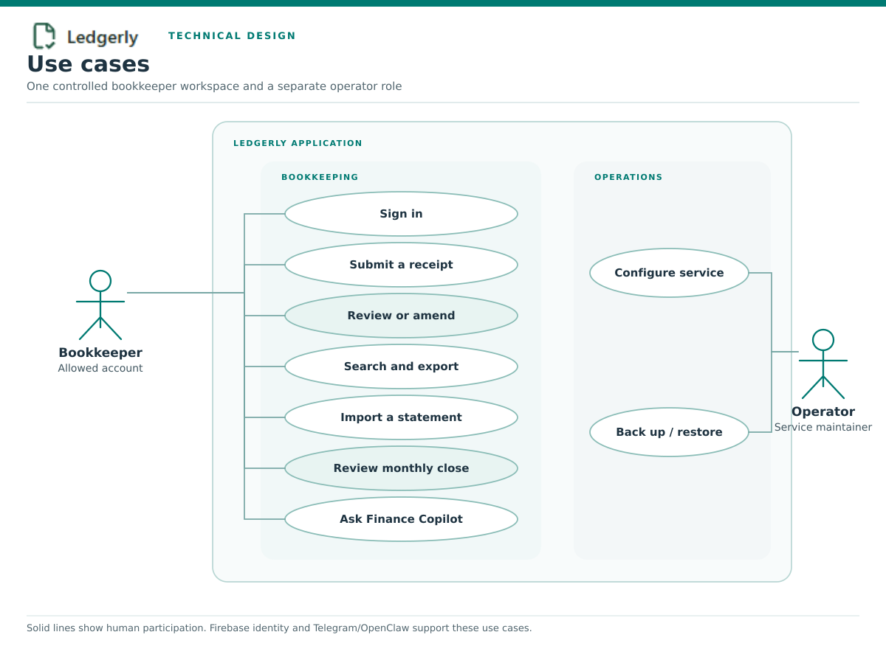
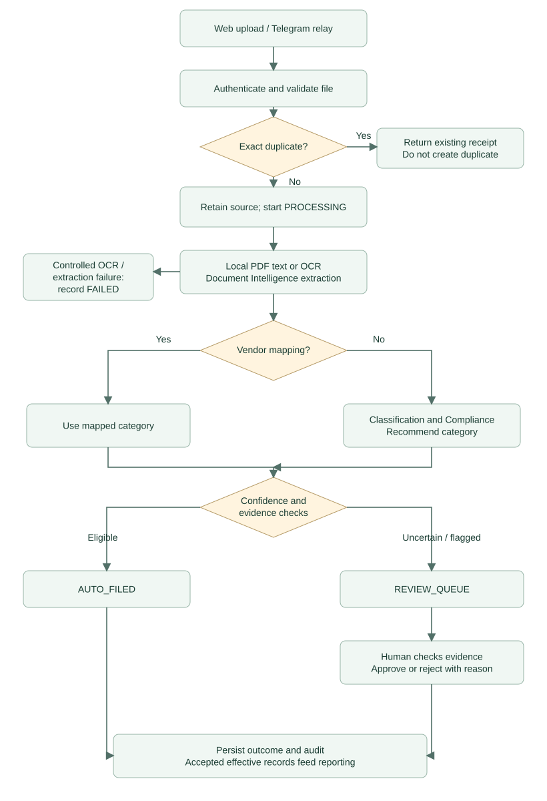
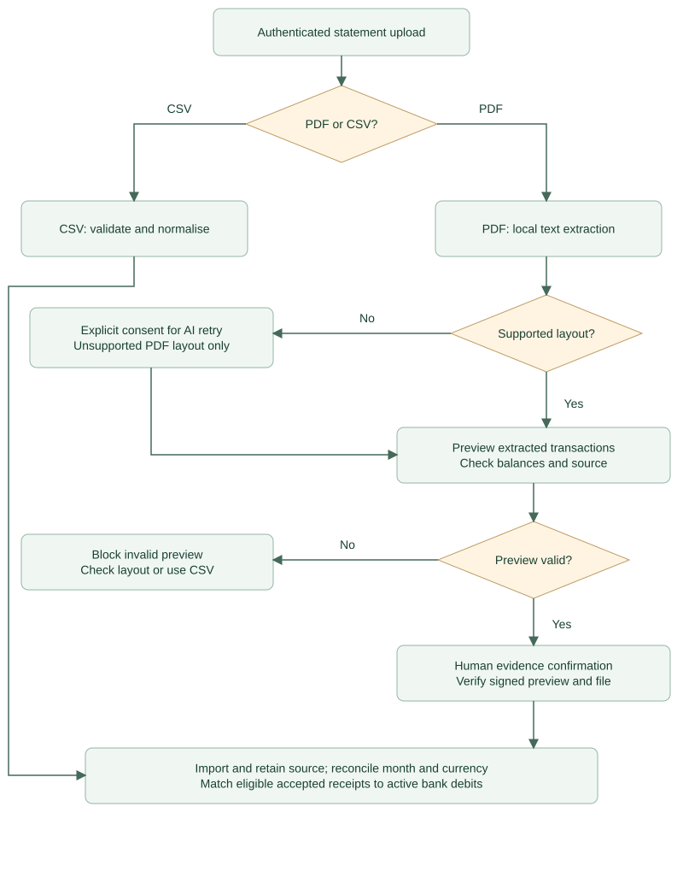
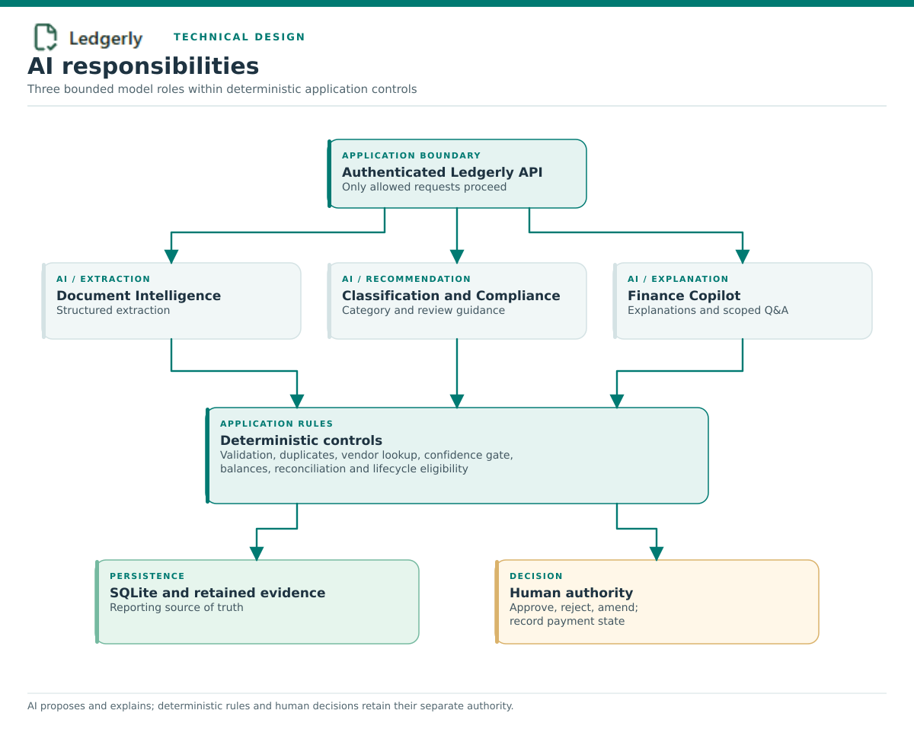
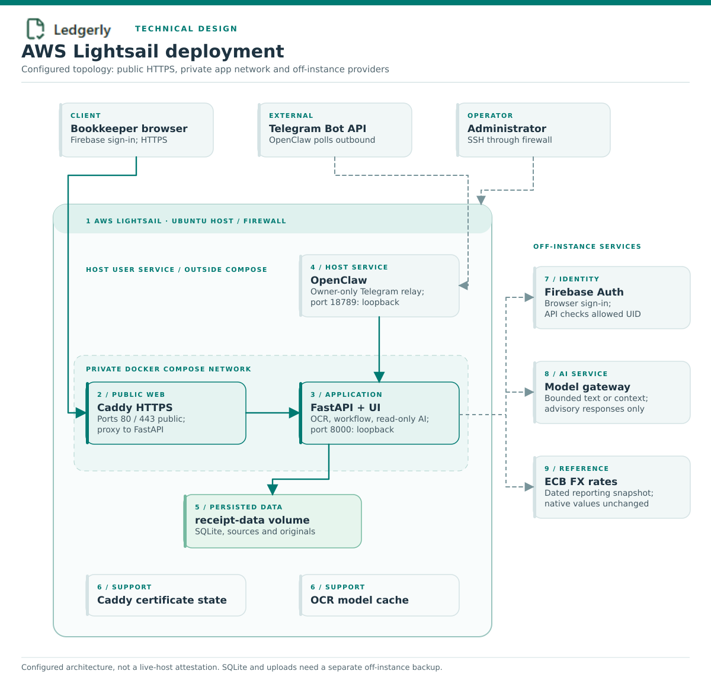

# Ledgerly architecture and data flow

This document describes the implemented single-bookkeeper MVP. Diagram arrows
show request or data flow; they do not grant a component authority beyond the
controls described here.
The AWS diagram shows the configured deployment topology. Check the actual host,
firewall, certificates and identity settings before treating it as a verified
picture of a live instance.

For current setup and release navigation, start at the [documentation index](index.md).
Effective-value SQL is repeated across several readers; the risks of
consolidation are tracked in the [maintenance review](maintenance-review.md).

## UML use cases

*Figure 1 — Ledgerly use cases and the two human roles.*

The bookkeeper performs receipt, review, reporting and monthly-close work. The
administrator operates configuration and recovery. Telegram/OpenClaw is an
alternate intake channel, not a second accounting system. External providers
support identity, model inference and exchange rates.

## Receipt-processing workflow

*Figure 2 — Receipt intake, extraction, category routing and decision gate.*

| Stage | Responsibility | Control boundary |
|---|---|---|
| Intake | Receive a JPEG, PNG or bounded PDF from the authenticated web UI or Telegram relay. | Web requests use configured Firebase identity; OpenClaw uses the application API key. |
| Validation | Check size, media type, magic bytes and exact SHA-256 duplicates. | Client filenames never determine stored paths; rejected temporary files are removed. |
| Extraction | Use embedded PDF text or local OCR, then the Document Intelligence responsibility. | PDF pages, pixels and processing time are bounded. Model output must match a strict schema. |
| Classification | Prefer exact vendor mappings; ask Classification and Compliance only when needed. | AI recommends a category but cannot approve, pay or mutate reconciliation. |
| Gate | Combine confidence, evidence flags and possible-duplicate signals. | Uncertainty routes to human review; model confidence cannot override deterministic controls. |
| Decision | Auto-file eligible clean results or record a reviewed approval/rejection. | Human decisions and amendments create auditable events. |
| Reporting | Read effective values for dashboards, exports and monthly close. | Totals and matching are deterministic; retained evidence remains separately reviewable. |

## Bank-statement and monthly-close workflow

*Figure 3 — Statement import and monthly close with distinct PDF and CSV controls.*

PDF import begins with deterministic extraction and a signed preview. The user
must verify each extracted debit against the source and can import only when the
balance control passes. Normalized CSV is the fallback for unsupported layouts.
Optional AI extraction is a separate, explicit-consent path. Import retains the
source, then deterministic reconciliation links debits to accepted receipts.
`No Bank Match` is an exception for investigation—not proof of a payable.

## AI responsibilities

*Figure 4 — Logical AI responsibilities and their limits.*

Ledgerly has three logical AI responsibilities inside one application boundary:

| Responsibility | Function | Maximum authority |
|---|---|---|
| Document Intelligence | Produce structured receipt or consented statement extraction. | Extract only |
| Classification and Compliance | Recommend categories and review guidance after deterministic checks. | Recommend only |
| Finance Copilot | Explain existing reconciliation and answer scoped monthly-close questions. | Read only |

Validation, arithmetic, duplicates, vendor lookup, confidence gating,
reconciliation and lifecycle eligibility remain deterministic. Some Copilot
answers can therefore be produced without a model call.

## AWS Lightsail deployment

*Figure 5 — Configured AWS Lightsail deployment and supporting services.*

| Pointer | Configured component | Exposure and purpose |
|---:|---|---|
| 1 | Lightsail firewall | Public web traffic is limited to ports 80/443; SSH is an administrative path. Ports 8000 and 18789 remain private. |
| 2 | Caddy container | Terminates TLS, redirects HTTP to HTTPS, applies response headers and proxies to the API through the private Compose network. |
| 3 | FastAPI container | Runs as UID/GID 10001 with reduced privileges. Host port 8000 binds to loopback only and production API docs are disabled. |
| 4 | OpenClaw user service | Runs outside Docker, binds the gateway to `127.0.0.1:18789` and polls Telegram outbound. Paired users require operator approval; groups are disabled in the MVP configuration. |
| 5 | Application data | The `receipt-data` volume contains SQLite, receipt uploads and retained statement sources. It survives container replacement, not volume or instance deletion. |
| 6 | Supporting volumes | Paddle cache avoids repeated model downloads; Caddy data/config volumes retain certificate state. Neither is a substitute for application backup. |
| 7 | Firebase Authentication | Authenticates the allowed browser user. It is an identity provider, not Ledgerly's SQL or receipt storage. |
| 8 | Organiser model gateway | Receives bounded text or permitted structured context, never application secrets. Failures are safe or clearly labelled fallbacks. |
| 9 | ECB reference rates | Provides dated reporting-rate snapshots; stored native receipt amounts are unchanged. |

The diagram intentionally omits public IPs, account IDs, email addresses, tokens,
keys, database paths and secret values. An `sslip.io` hostname is suitable for
the current MVP but should be replaced with a domain the operator controls before
broad public use.

## Trust and recovery boundaries

- **Public:** only Caddy on 80/443 and controlled SSH administration.
- **Identity:** allowed Firebase UID for the browser; high-entropy application key
  for trusted integrations.
- **AI:** extraction, recommendation and explanation only; irreversible financial
  decisions stay outside model authority.
- **Persistence:** SQLite is the reporting source of truth; retained files are
  evidence, not executable content.
- **Recovery:** Docker volumes are not backups. Create a consistent database and
  evidence archive, verify its checksum and copy it to a protected off-instance
  destination. A Lightsail snapshot is an additional recommended layer.
