# Ledgerly user guide

This guide walks through the implemented MVP using synthetic demonstration data.
Screenshots containing an account email have been redacted. The examples show
workflow states, not evidence that an external payment or accounting entry occurred.

## Receipt intake and review

### Upload and triage

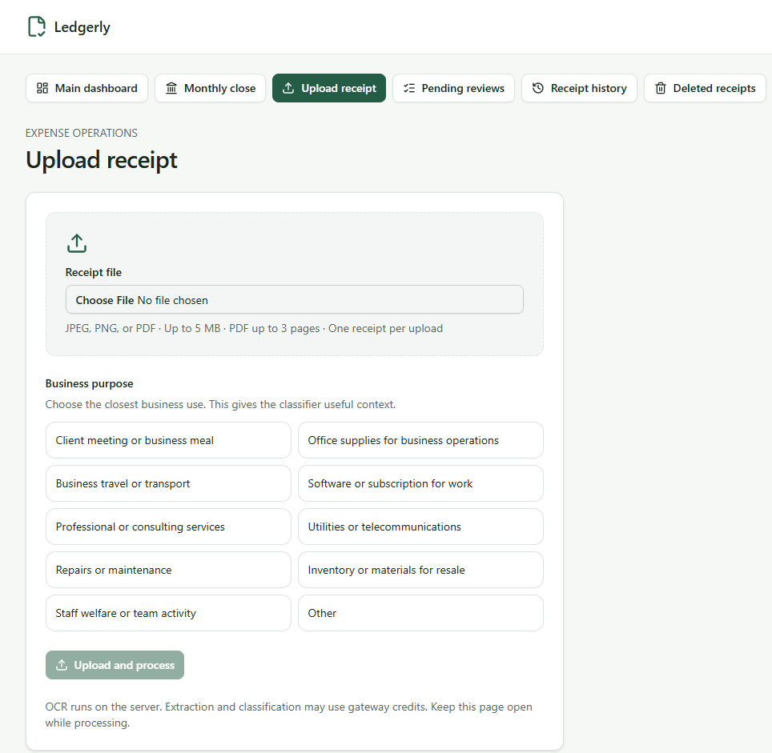

Upload a JPEG, PNG or bounded PDF through the web workspace. Telegram receipts
reach the same authenticated backend through the OpenClaw relay.

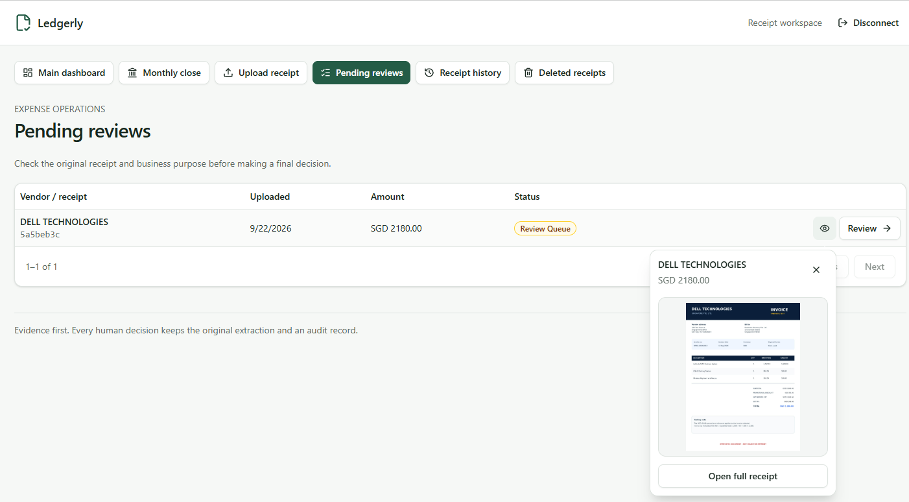

Receipts with uncertain extraction, classification or duplicate evidence enter
the review queue. Open the retained source before deciding.

### Check evidence and record a decision

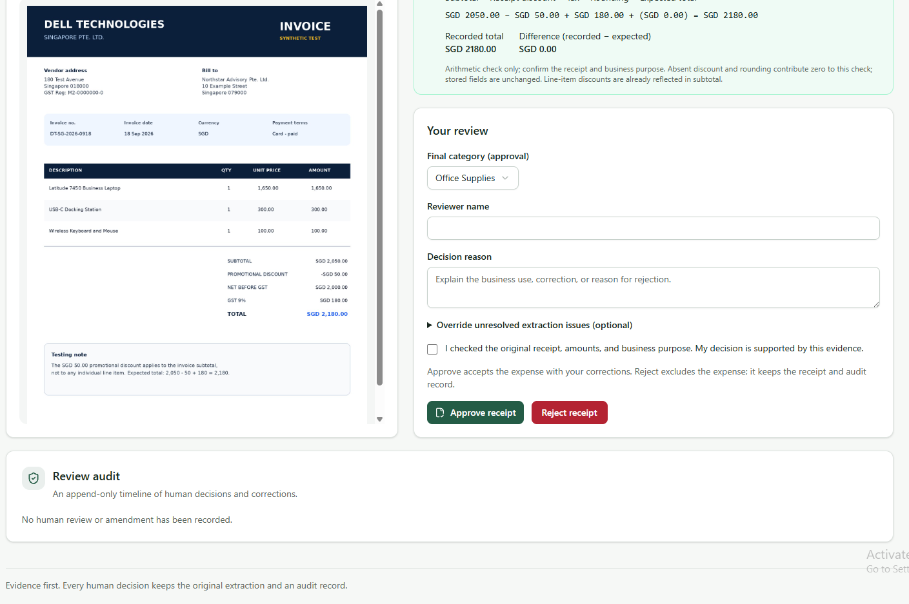

Compare the original receipt with the vendor, receipt number, date, currency,
amounts and payment information. Arithmetic checks support review but do not prove
business purpose or authenticity.

Select the final category, enter the reviewer and reason, then explicitly confirm
that the original evidence was checked. AI assistance cannot approve for the
reviewer.

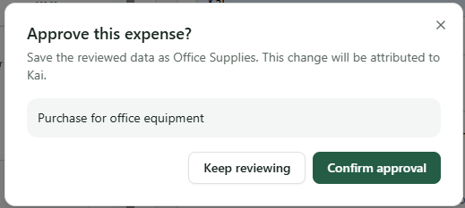

Approval or rejection records an auditable human decision. Accepted records use
amendment or void workflows rather than silent edits.

### Audit and correction

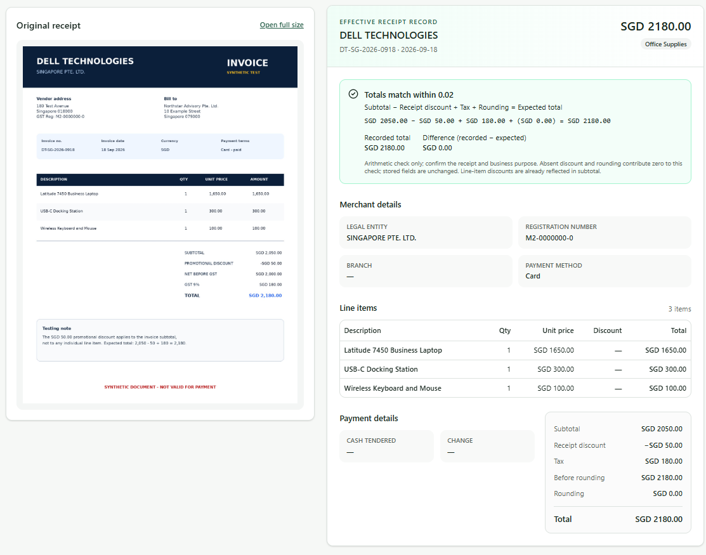

The effective values remain visible beside the retained source. The displayed
Dell document says `Card - paid`; that label is not proof of an operating-account
bank match.

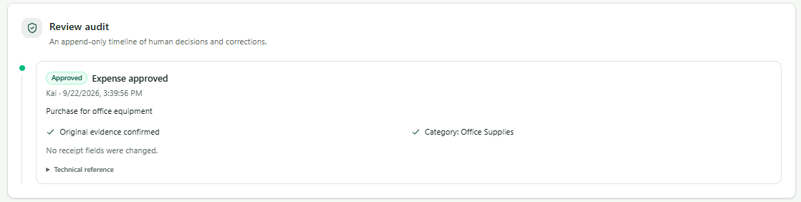

The audit records the outcome, reviewer, reason and evidence confirmation.

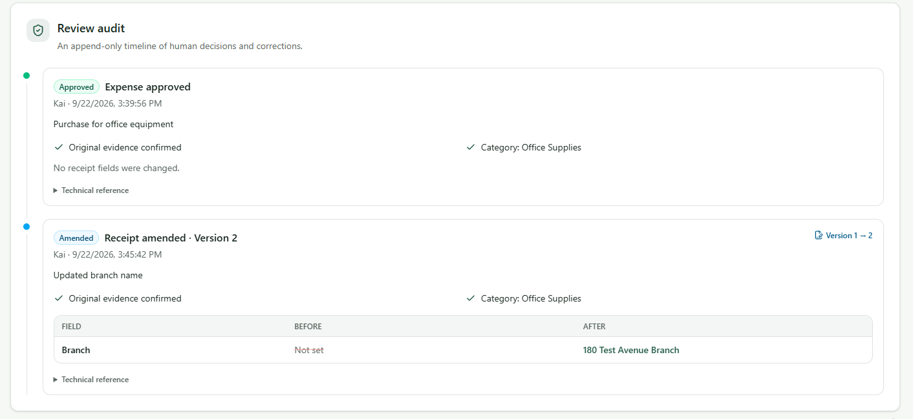

An amendment creates a new effective version while preserving the earlier values
and source evidence.

## Dashboard and reporting

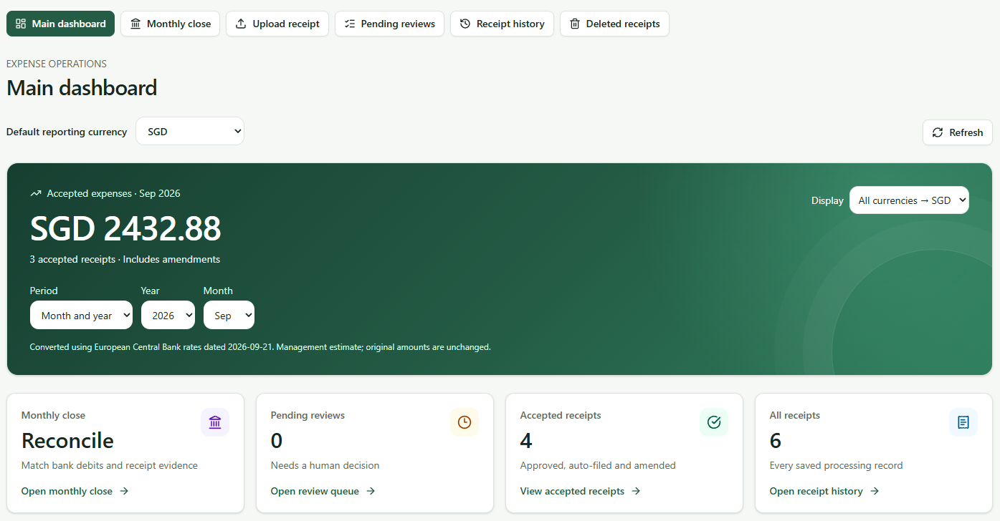

This earlier screenshot shows the previous period selector. The current dashboard
places one receipt-date range beside the default reporting currency. Choose All time
(first to latest dated accepted receipt), latest month, latest three months,
latest receipt year, or enter start and end dates and select **Apply dates**.
The quick ranges end at the latest accepted receipt date. The same inclusive
range updates the accepted total, receipt count, chart and categories. Select
**View this date range** to open the matching accepted receipts in history.

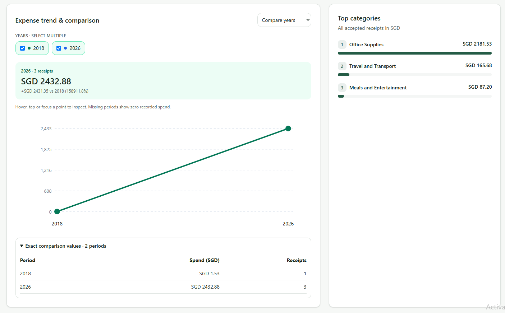

This earlier screenshot shows the previous comparison controls. The chart now uses
monthly points for ranges of up to 24 months and yearly points for longer ranges;
you can still inspect points and exact values. Reporting currency conversion does
not alter original receipt amounts. Undated accepted receipts remain in history
but are not included in dated reporting.

## Monthly close

Start in **Overview** to check all recorded periods across years. Months with accepted receipts appear even when you have not imported a bank statement. Use **Needs attention only** to focus on missing statements, exceptions and outdated reviews. Open a period for its original-currency reconciliation. A month is shown as reviewed only after you record the reviewer and note; evidence changes flag the review as outdated. Reviewing a month does not automatically resolve its exceptions.

### Import a statement

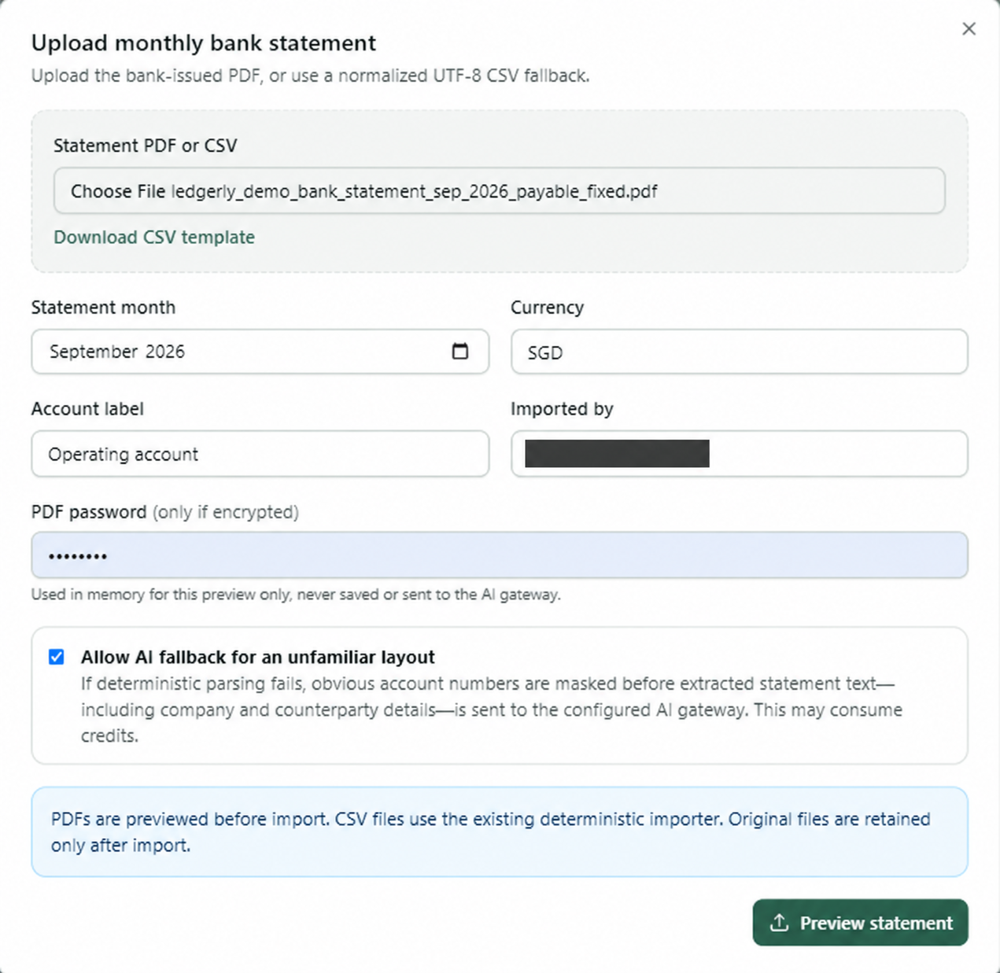

Choose a bank PDF or normalized CSV, month and currency. The email in this
privacy-reviewed screenshot is redacted. Deterministic PDF parsing is private by
default; optional AI fallback requires explicit consent, and a PDF password is
used only in memory for preview.

The preview contains two debit rows totalling SGD 252.88 and a passing balance
check. The balance panel explains opening balance + credits − debits versus the
statement closing balance, with the difference when they disagree. The reviewer
must compare every row with the source before import.

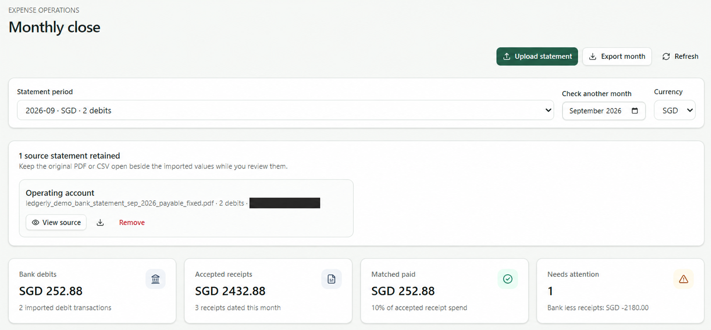

After import, the retained statement can be opened again. Bank debits and matched
paid both show SGD 252.88, with one receipt still needing attention. The email in
this screenshot is redacted.

### Resolve exceptions

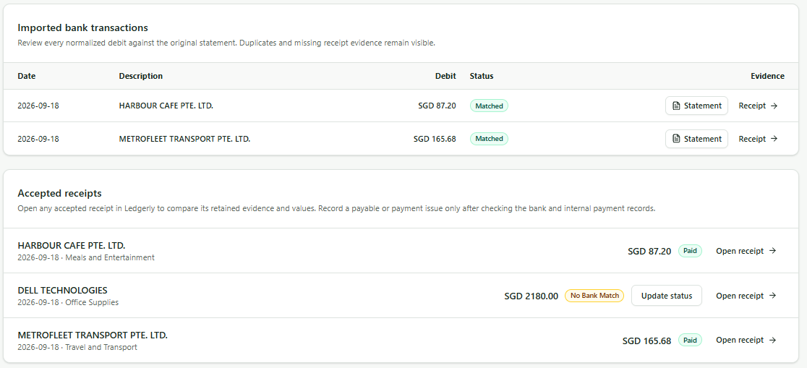

Harbour Cafe and Metrofleet are matched and paid. Dell remains `No Bank Match`.
That status alone does not prove an unpaid invoice, a failed payment or fraud.

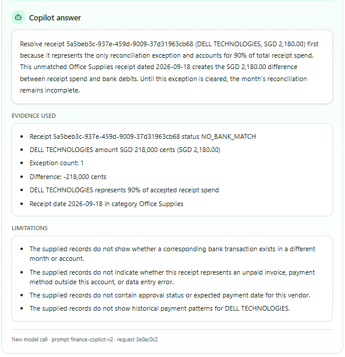

Finance Copilot prioritises the SGD 2,180 gap and explains evidence and limits.
Its output is advisory and does not execute a change. In model context, 218,000
cents represents SGD 2,180.

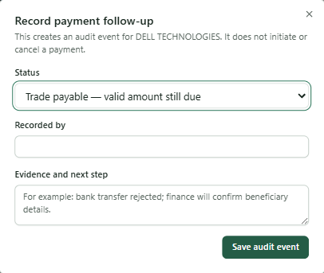

The `Trade payable` option is selected, but the reviewer and evidence fields are
blank. This is an unsaved dialog—not proof that a payable was recorded. Resolve
the conflict between the receipt's `Card - paid` label and the missing bank match
before saving a payment follow-up.

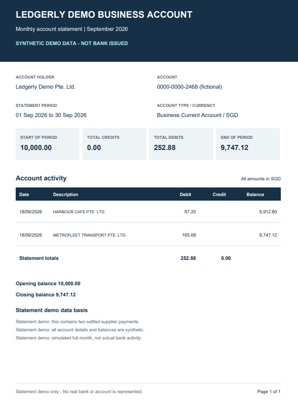

The synthetic September statement remains available for cross-checking imported
values.

## Complete screenshot inventory

The privacy-reviewed demonstration set contains 38 screenshots. The focused guide
above uses the most informative views; the full set is retained in
[`assets/screenshots`](assets/screenshots/) for traceable product review.

## Interpretation limits

- AI agents extract, recommend or explain; they do not approve, pay or post.
- PDF parsing is layout-dependent. Use normalized CSV when a bank PDF cannot be
  validated safely.
- Optional AI statement extraction requires consent; an invalid deterministic
  preview does not currently trigger an automatic AI retry.
- `No Bank Match` is an exception signal, not a payable determination.
- Screenshots show synthetic demo states and may represent different points in the
  workflow.
