# Ledgerly user guide

This guide walks through the implemented MVP using demonstration data. The dashboard, Receipt history, Deleted receipts and Monthly Close images were supplied on 23 September 2026; the receipt-review and statement-import examples are earlier, privacy-reviewed captures. Screenshots show workflow states, not proof of an external payment or accounting entry. Check original evidence before making a financial decision.

## Access and navigation

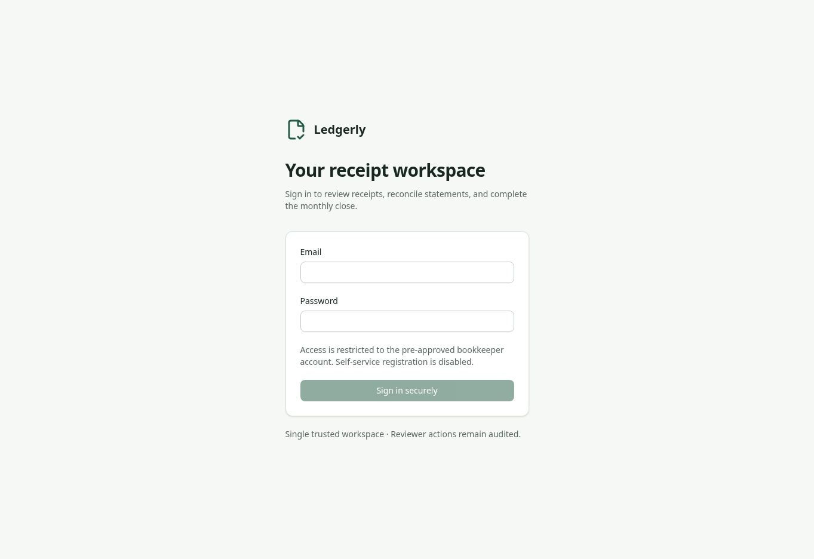

*Current sign-in screen*

The deployed public page requires the pre-approved bookkeeper account. Signing in does not create another account. The top navigation has **Main dashboard**, **Monthly close**, **Upload receipt**, **Pending reviews**, **Receipt history**, and **Deleted receipts**. Use the dashboard for dated expense reporting, and Monthly close to compare accepted receipts with retained bank statements.

The sign-in image is a current capture from the deployed page. The dashboard, history, deleted-receipt and Monthly Close views below are newly supplied authenticated screenshots. The Telegram examples were supplied separately; the web receipt-review and statement-preview images remain from an earlier test. Examples from different sessions and stages should not be combined into one accounting reconciliation.

## Receipt intake and review

### Upload and triage

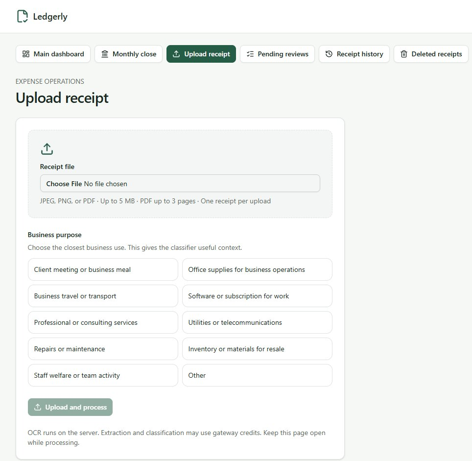

*Upload a receipt*

Upload a JPEG, PNG or bounded PDF through the web workspace. Telegram receipts reach the same authenticated backend through the OpenClaw relay.

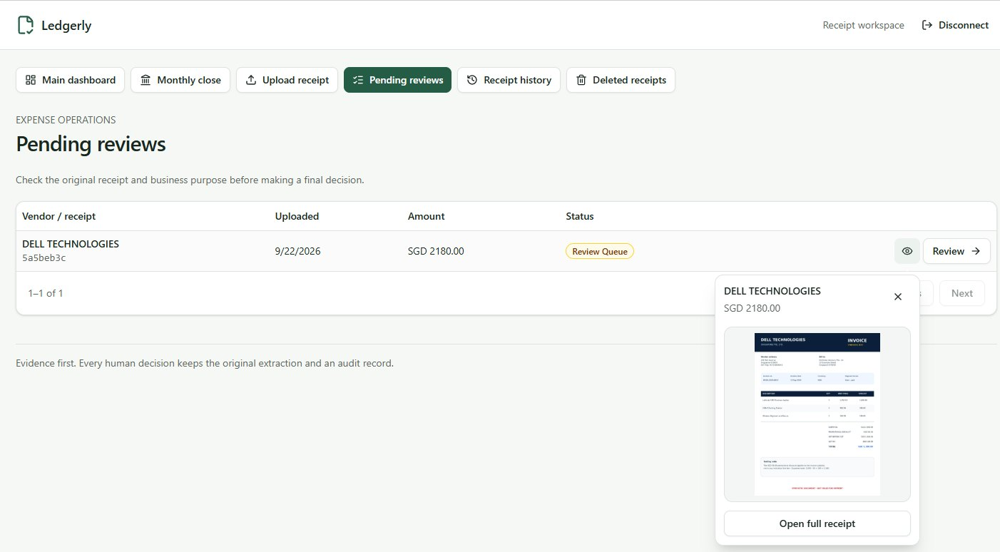

*Pending reviews*

Receipts with uncertain extraction, classification or duplicate evidence enter the review queue. Open the retained source before deciding.

### Telegram example: receipt auto-filed

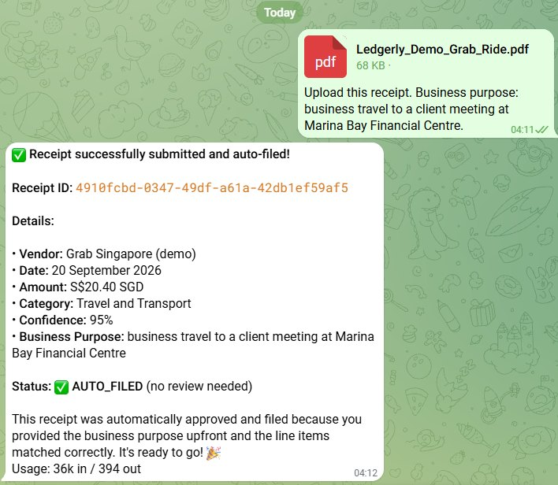

*Telegram chat showing a synthetic Grab ride receipt and its AUTO_FILED result*

In this separate demo run, the user attaches one paid sample receipt and states the business purpose in the same Telegram message. The bot reports **Grab Singapore (demo)**, **20 September 2026**, **SGD 20.40**, **Travel and Transport**, **95% confidence** and `AUTO_FILED`. The receipt’s two charges add to its printed subtotal, and the business purpose reaches Ledgerly. There is no pending human review for this upload. `AUTO_FILED` is Ledgerly’s internal classification decision: the bot’s phrase “automatically approved and filed” does not mean a person approved it, a bank payment was verified or an external accounting system received an entry. This screenshot shows a synthetic test, not evidence of an actual Grab trip or payment.

### Telegram example: receipt needs review

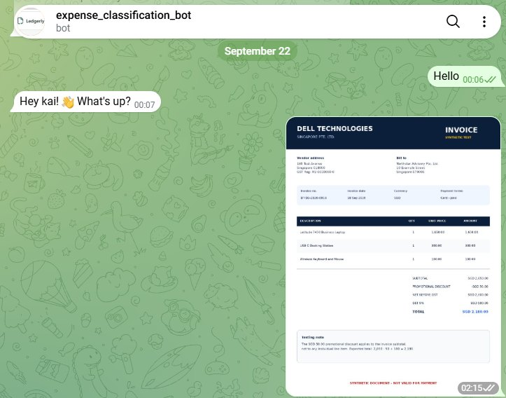

*Telegram chat showing a synthetic Dell invoice sent to Ledgerly*

The user sends the receipt to the Ledgerly Telegram bot and requests an upload. The bot returns the result of Ledgerly’s receipt processing in the same chat.

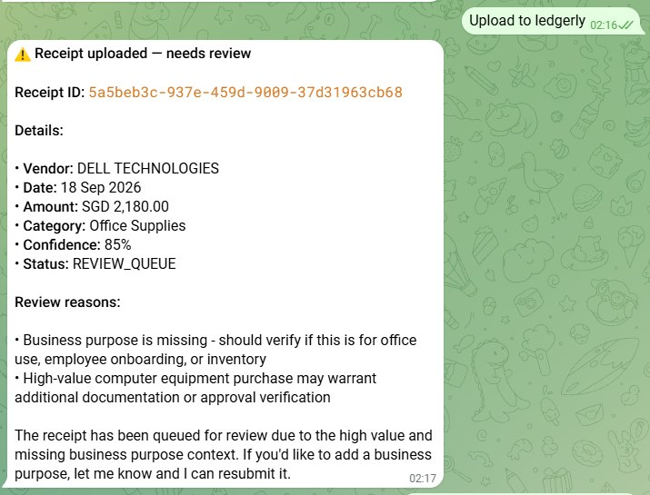

*Telegram reply showing the receipt ID, extracted fields and review reasons*

In this example, the bot reports **Receipt uploaded — needs review** and `REVIEW_QUEUE`. The extracted values are **DELL TECHNOLOGIES**, **18 September 2026**, **SGD 2,180.00**, **Office Supplies** and **85% confidence**. It flags a missing business purpose and the high value of the computer-equipment purchase. This is a successful upload routed to a human reviewer, not an upload error or an approved expense. In **Pending reviews**, open the retained original, check the extracted amounts and supporting business purpose, then record the decision with a reason. The bot’s suggestion to provide more context does not replace the web review or automatically approve the receipt. This Telegram capture is a separate demo run from the accepted Dell receipt shown later in the guide; do not assume that two screenshots show the same record merely because their vendor and amount agree.

### Check evidence and record a decision

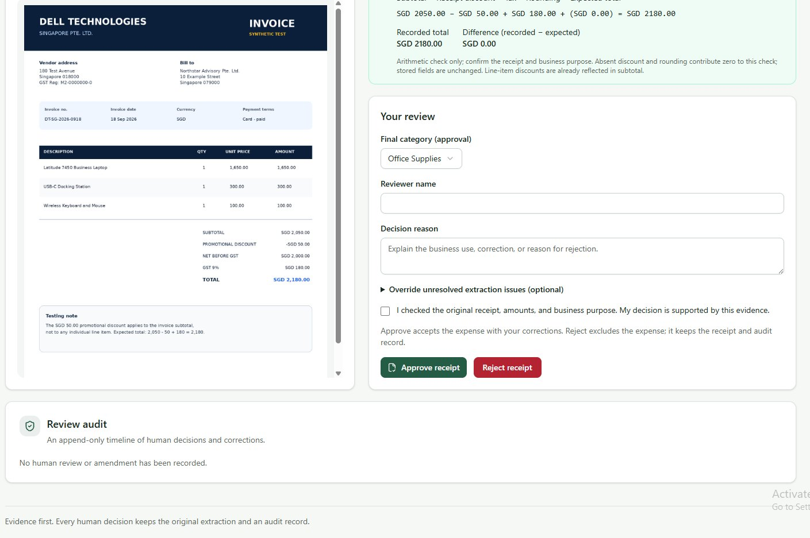

*Original receipt and extracted fields*

Compare the original receipt with the vendor, receipt number, date, currency, amounts and payment information. Arithmetic checks support review but do not prove business purpose or authenticity.

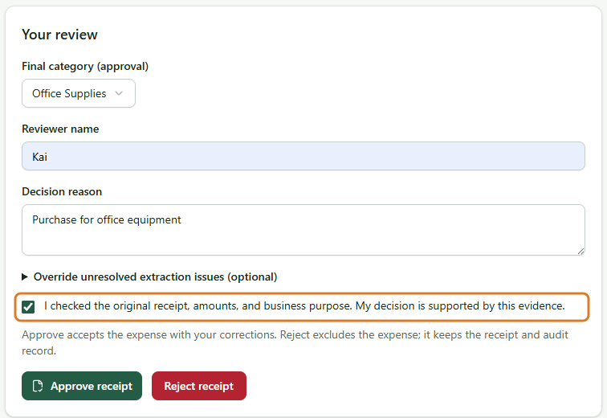

*Correctly annotated review confirmation*

Select the final category, enter the reviewer and reason, then explicitly confirm that the original evidence was checked. AI assistance cannot approve for the reviewer.

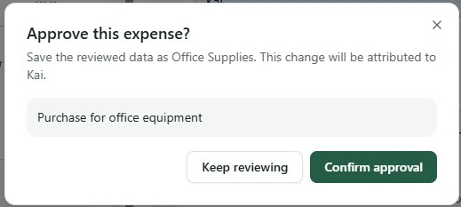

*Review confirmation*

Approval or rejection records an auditable human decision. Accepted records use amendment or void workflows rather than silent edits.

### Audit and correction

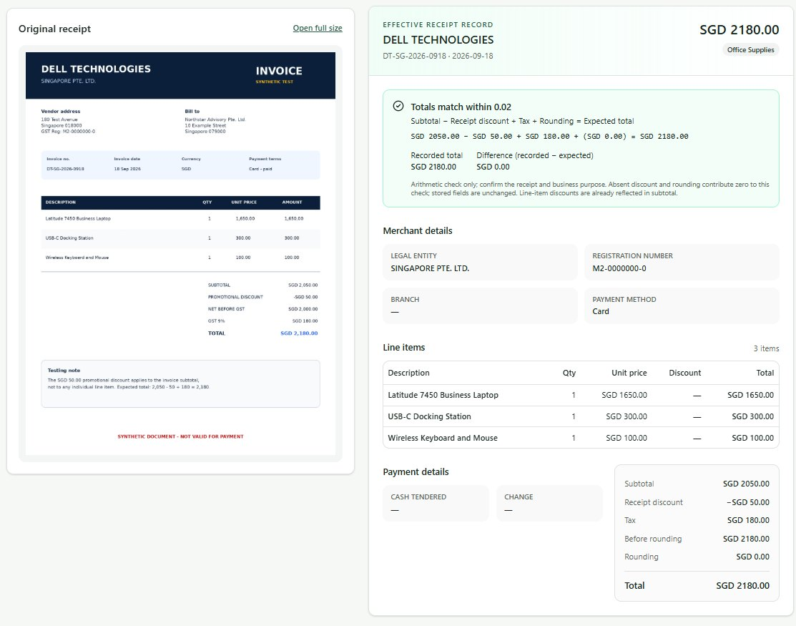

*Accepted receipt detail*

The effective values remain visible beside the retained source. The displayed Dell document says `Card - paid`; that label is not proof of an operating-account bank match.

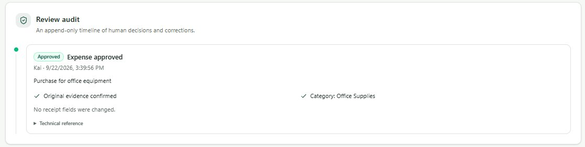

*Review audit*

The audit records the outcome, reviewer, reason and evidence confirmation.

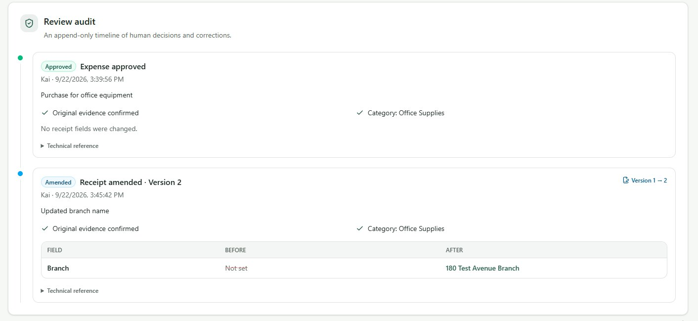

*Amendment comparison*

An amendment creates a new effective version while preserving the earlier values and source evidence.

## Dashboard and reporting

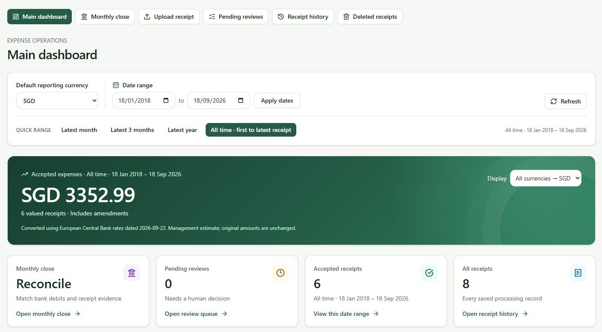

*Main dashboard with reporting currency, date range and All time total*

The default reporting currency sits beside a shared receipt-date range. **All time · first to latest receipt** selects the first through latest dated accepted receipt. Choose **Latest month**, **Latest 3 months** or **Latest year**; or enter both dates and select **Apply dates**. Quick ranges end at the latest accepted receipt date. The same inclusive range updates the accepted total, receipt count, trend and category totals. **View this date range** opens Receipt history with those dates and accepted statuses already selected. **Open receipt history** opens the full history instead.

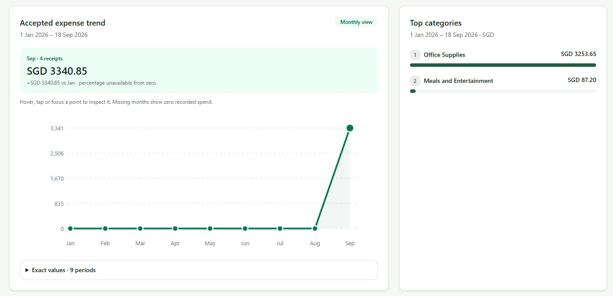

*Accepted expense trend and top categories for the Latest year range*

This trend is a *different selection* from the All time image: Latest year, 1 January–18 September 2026. Hover, tap or focus a chart point, or expand **Exact values** to inspect each period. Ranges up to 24 months use monthly points; longer spans use yearly points. Missing periods display zero recorded spend. Default-currency conversion is a management view and does not overwrite the amounts on original receipts. Undated accepted receipts remain in history but are excluded from dated reporting.

See a quick-range selection

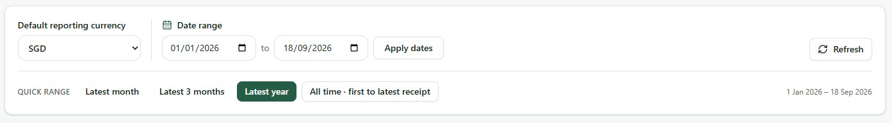

*Latest year selected beside default reporting currency*

## Receipt history and Excel export

### Export accepted receipts from a date range

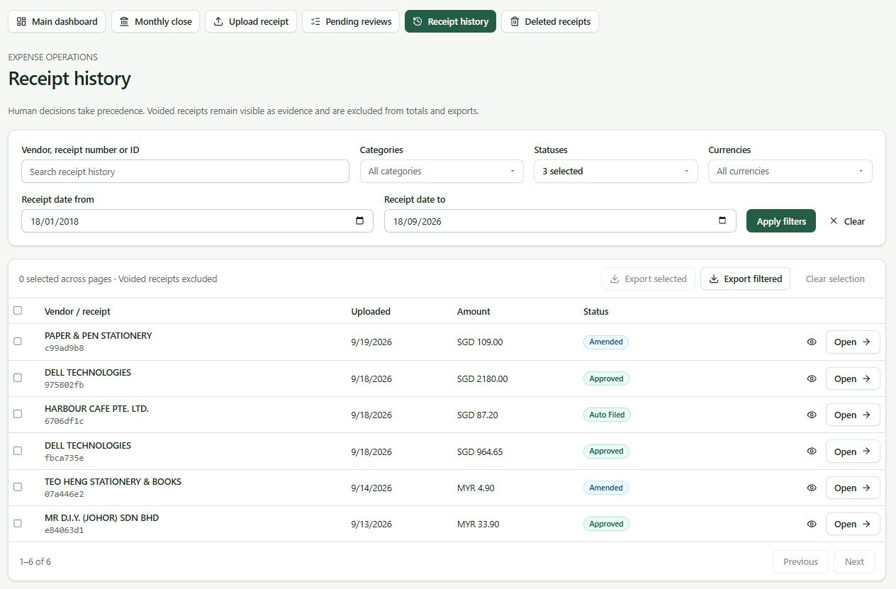

*Receipt history with accepted statuses and the dashboard date range applied*

From the dashboard, **View this date range** opens Receipt history with its receipt dates and the accepted statuses **Auto Filed**, **Approved** and **Amended** already selected. Select **Apply filters** after changing search, category, status, currency or receipt dates. **Export filtered** downloads all records matching the applied filters, including results on other pages; the button does not require checking rows. The app limits a filtered export to 1,000 rows. Voided and deleted receipts are excluded.

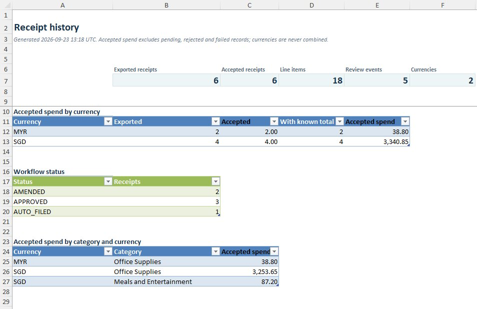

*Overview sheet for six accepted receipts exported using the applied filters*

In this example, the workbook includes six accepted receipts: four in SGD totalling **SGD 3,340.85** and two in MYR totalling **MYR 38.80**. The currencies stay separate; the workbook does not add SGD and MYR together. Accepted spend excludes pending, rejected and failed records even when those statuses are present in a broader export. Review the **Receipts**, **Line items** and **Review audit** sheets for the values and decisions behind the overview.

See the full-export receipt, line-item and audit sheets

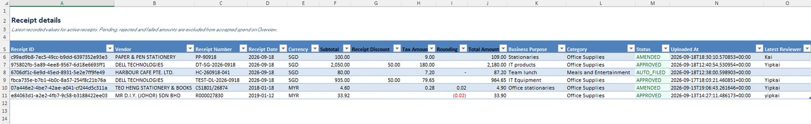

*Receipt details in the six-receipt filtered export*

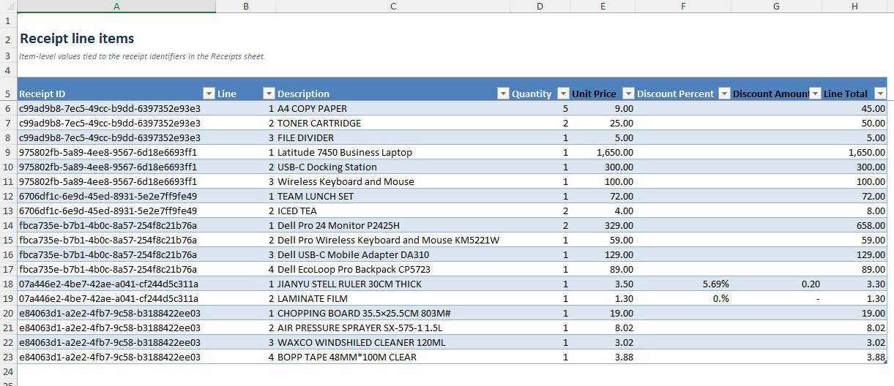

*Line items tied to receipt IDs in the filtered export*

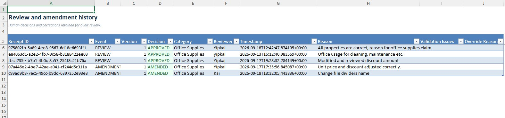

*Human review and amendment history in the filtered export*

### Export selected receipts only

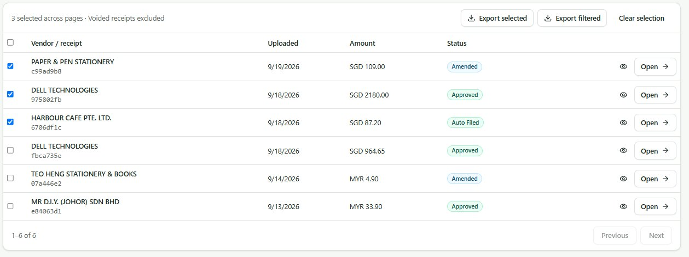

*Three checked rows with Export selected enabled*

Check the receipt rows you need, then choose **Export selected**. Selection persists across pages, while changing or clearing filters resets it. The selected export accepts 1–500 receipt IDs. Here the selected rows are Paper & Pen Stationery (**SGD 109.00**), Dell Technologies (**SGD 2,180.00**) and Harbour Cafe (**SGD 87.20**).

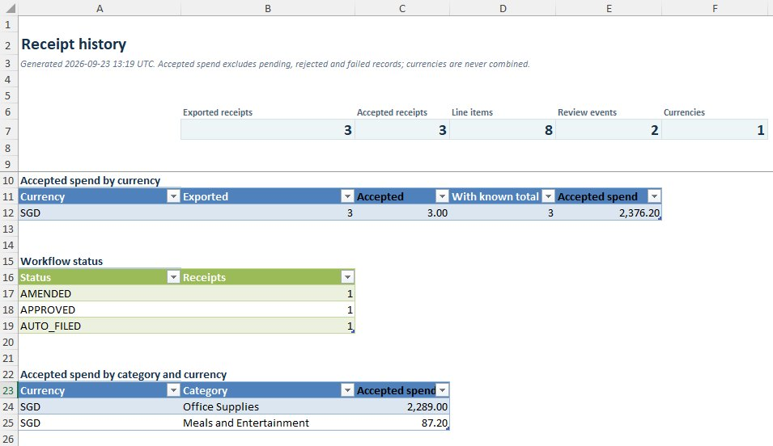

*Overview sheet for the three manually selected receipts*

Their accepted spend is **SGD 2,376.20** (109.00 + 2,180.00 + 87.20). This workbook contains three receipts, eight line items and two review events; the full filtered workbook above contains six receipts and two currencies. An explicit selection of a deleted or voided receipt is rejected instead of silently producing an incomplete workbook.

See which receipt rows entered the selected export

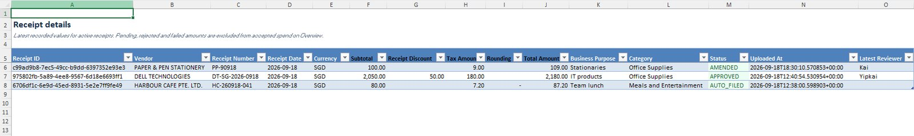

*The three receipt detail rows in the selected export*

See [history filters and Excel export](export.md) for filter behavior, sheet contents and export limits.

## Deleted receipts and restoration

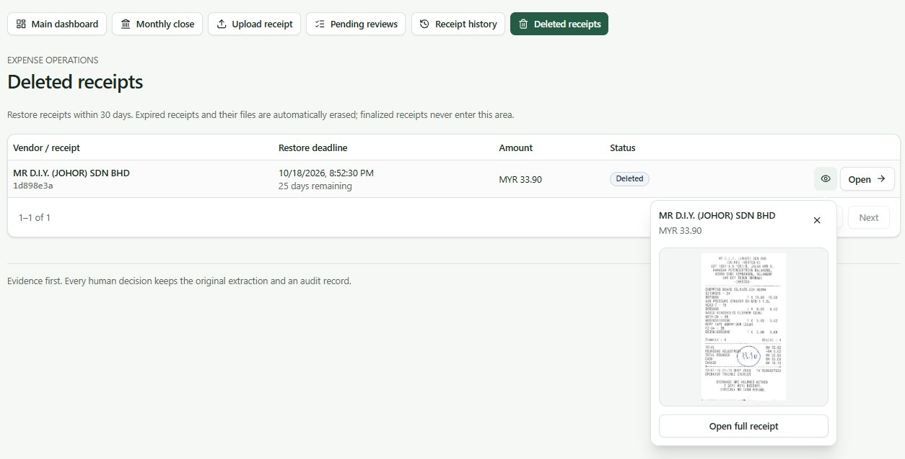

*Deleted receipts list with a restore deadline and original preview*

Choose **Deleted receipts** in the top navigation to inspect recoverable records. The list shows a restore deadline, remaining time, status and an authenticated preview of the retained source. Select **Open** to inspect the receipt’s details; this example is an MYR 33.90 receipt. Deletion removes it from ordinary history, totals and exports during the retention window.

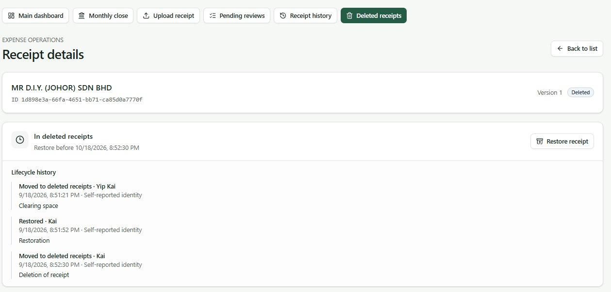

*Deleted receipt detail with Restore receipt and lifecycle history*

**Restore receipt** is available before the 30-day deadline, subject to the app’s duplicate-file checks. The lifecycle history preserves the recorded actions and self-reported reviewer labels. In this image an earlier restore appears in the history, but the receipt currently shown is **Deleted**; the button has not been used in this pictured state. Processing receipts must finish processing before deletion; accepted receipts use **Void receipt** and do not enter Deleted receipts. See [receipt lifecycle](receipt-lifecycle.md) for eligibility, retention and conflict handling.

## Monthly close

### Find the period

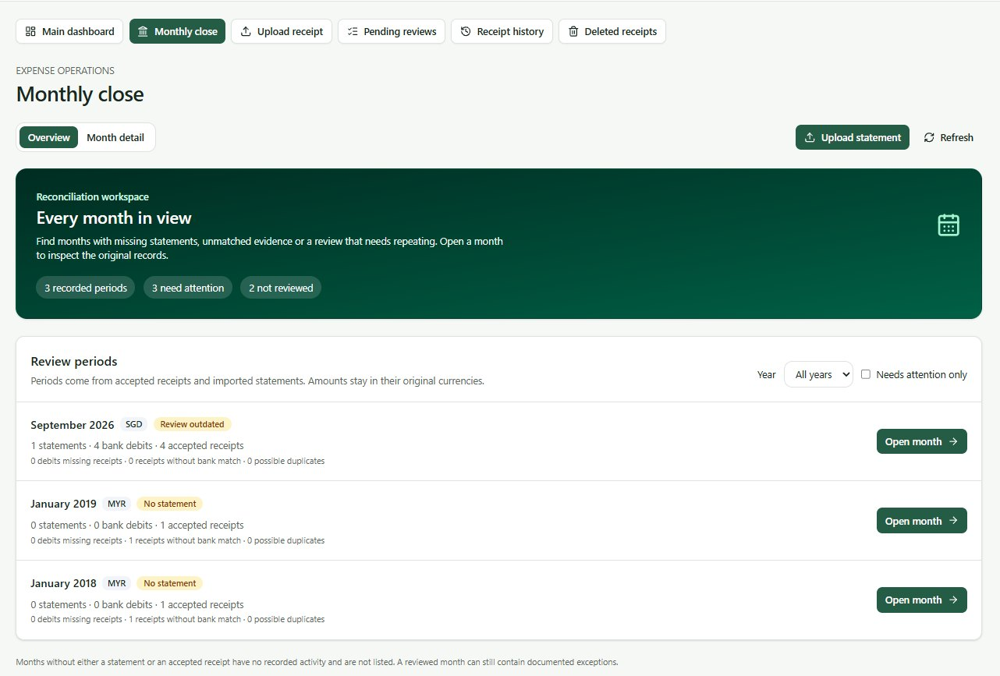

*Monthly Close overview with three recorded periods*

Choose **Monthly close → Overview** to check recorded periods across years. Months with accepted receipts appear even when no statement is imported. Choose **All years** or a specific year; **Needs attention only** narrows periods with missing statements, exceptions or outdated reviews. Select **Open month** to inspect one month and original currency. The September example above shows **Review outdated** even though its four bank debits and four accepted receipts have no matching exceptions: the evidence changed after its previous review.

### Read Month detail

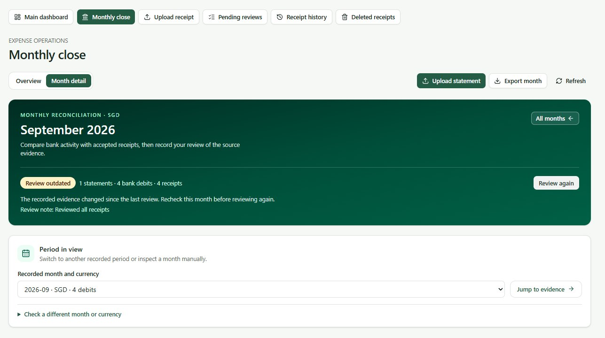

*Month detail header with Review outdated, All months and Jump to evidence*

The header names the month, currency and review state. **All months** returns to Overview; **Period in view** switches recorded months. Expand **Check a different month or currency** to inspect an unlisted period. **Jump to evidence** moves to the bank and receipt lists within this same Month detail page.

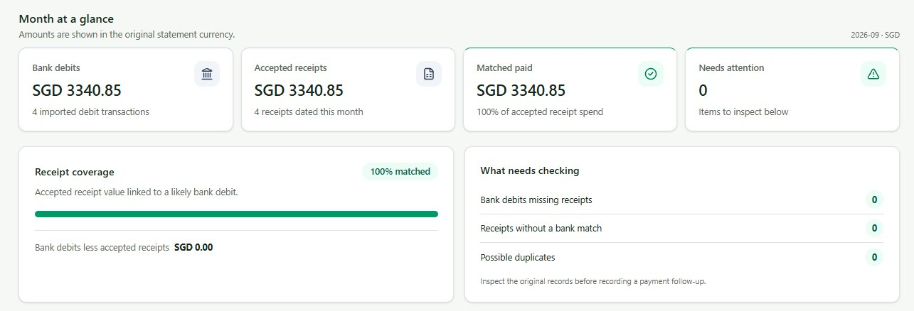

*Monthly totals, receipt coverage and exception counts*

**Month at a glance** covers the *whole selected month*, in its original currency. In this demonstration, four accepted receipts total SGD 3,340.85, four imported debits total SGD 3,340.85, and all four have likely matches. The 0 exceptions and 100% receipt coverage do not make a previous review current: the evidence still needs to be checked again.

### Upload and validate a statement (earlier example)

The upload and validation screenshots below come from an **earlier, separate two-debit test**. Its SGD 252.88 total is unrelated to the four-debit SGD 3,340.85 month in the newer views.

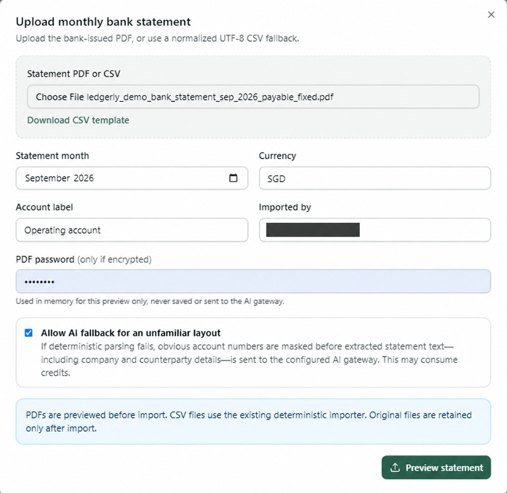

*Statement upload form*

Choose a bank PDF or normalized CSV, month and currency. The email in this privacy-reviewed screenshot is redacted. Deterministic PDF parsing is private by default; optional AI fallback requires explicit consent, and a PDF password is used only in memory for preview.

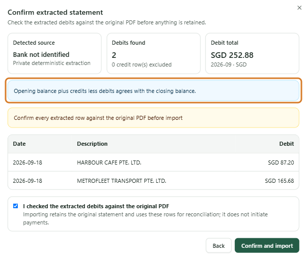

*Correctly annotated statement validation*

The preview contains two debit rows totalling SGD 252.88 and a passing balance check. The balance panel explains opening balance + credits − debits versus the statement closing balance, with the difference when they disagree. The reviewer must compare every row with the source before import.

### Inspect retained statements (current example)

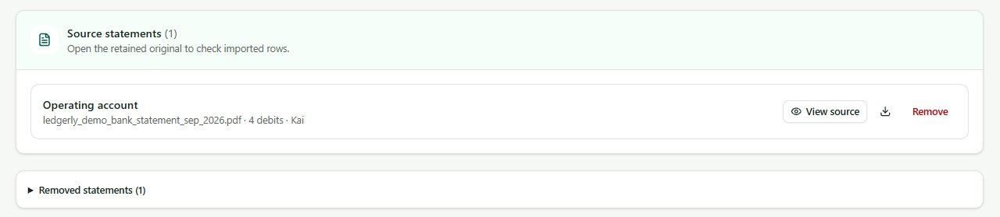

*Current Source statements section with view, download, remove and removed-statement controls*

In the newer four-debit example, **Source statements** keeps the original document available for cross-checking. **View source** opens the retained file; the download icon retrieves it. **Remove** excludes an incorrect import with an audit record; **Removed statements** offers restore. Removing a statement can recalculate matches and make a previously recorded monthly review outdated.

### Compare evidence and handle exceptions

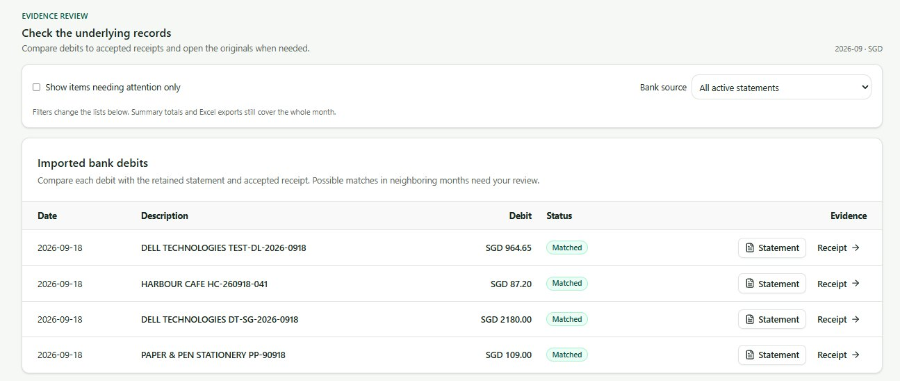

*Evidence filters and the four imported bank debit rows*

Use **Show items needing attention only** and **Bank source** to narrow the lists. Filters do not change the monthly totals or Excel export. Each debit can link to its retained statement and, where a likely match exists, the receipt. The four debits here are labelled **Matched**.

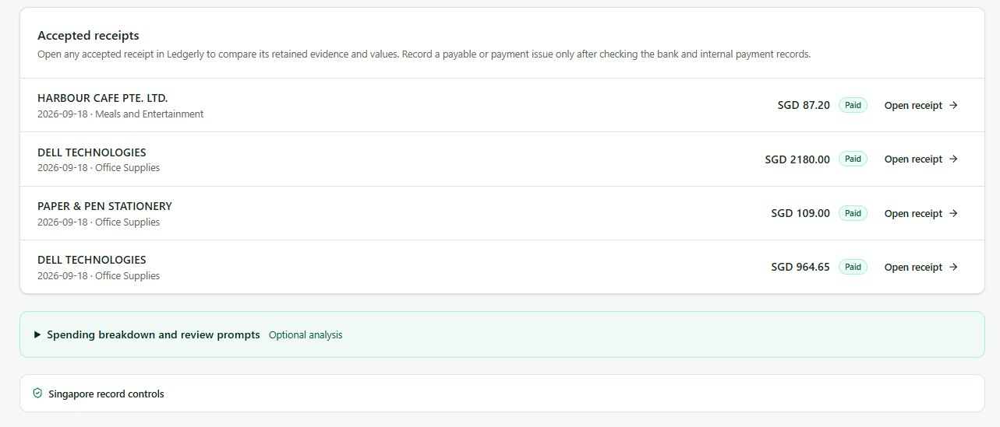

*Four accepted receipts and links to their evidence*

The accepted receipts here display **Paid** because the app found likely bank matches. Compare the original receipt and bank document before relying on a match; the status is not independent proof of settlement. **Open receipt** opens its retained evidence; **Back to Monthly Close** returns to the selected month, currency and filters. Possible matches in neighboring months are inspection hints and never mark a receipt paid automatically.

If a receipt has **No Bank Match**, inspect bank and internal payment records before recording **Trade payable** or **Payment issue**. A trade payable can include an optional invoice due date and planned payment date. Those are follow-up dates, not payment instructions or proof of payment. Saved status changes remain in **View payment-status history**, with actor, note and version.

See the optional spending breakdown

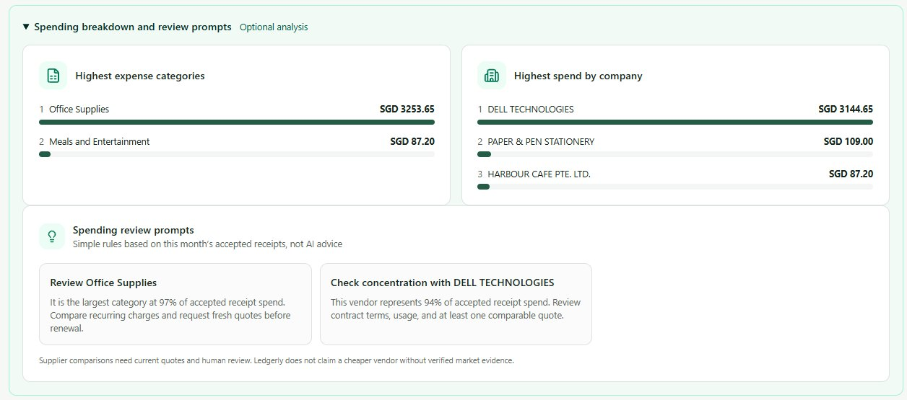

*Spending by category and company with deterministic review prompts*

These prompts come from deterministic rules on the selected month’s accepted receipts, not from Finance Copilot.

### Ask Finance Copilot

Select **Ask Finance Copilot** in Monthly Close to open the period-scoped, read-only panel. Choose **Explain exceptions**, **Build close brief**, a suggested question or your own question about that month’s recorded evidence.

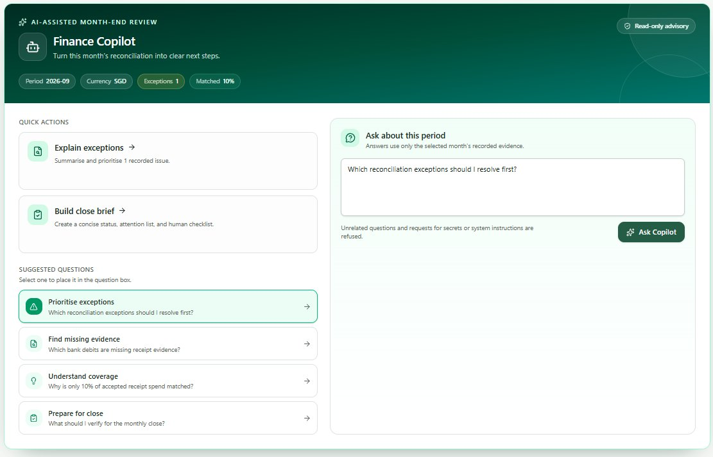

*Finance Copilot with suggested questions and the Ask about this period box*

This earlier **September 2026** demo state has one exception and **10% matched**. The selected suggestion asks which reconciliation exception to resolve first. It is a different state from the fully matched September views elsewhere in this guide.

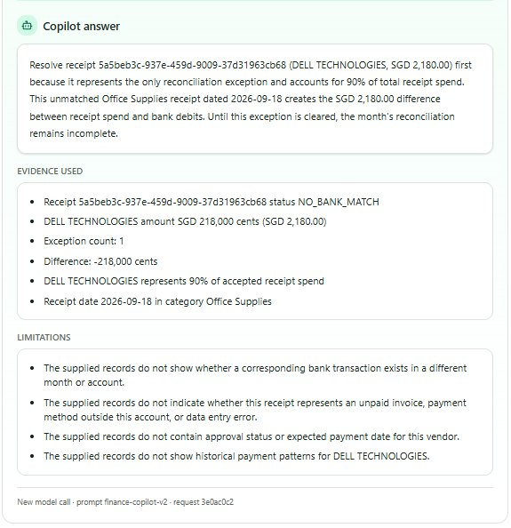

*Finance Copilot answer showing evidence used and limitations*

The answer prioritises an unmatched **SGD 2,180.00 Dell receipt**, shows the receipt and amount it used, and explains what the available records cannot establish. A missing bank match alone does not establish whether a supplier is unpaid: check the original and payment evidence before deciding. Copilot can explain exceptions and prepare a close brief; it cannot change records, approve expenses or pay a supplier.

### Record a monthly review and export

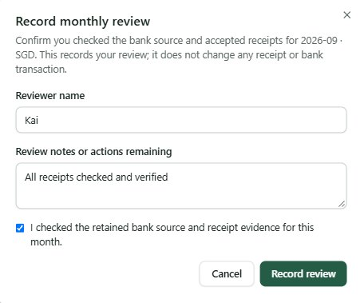

*Monthly review dialog with reviewer, note and evidence confirmation*

After checking the retained bank statement, debit rows and accepted receipt evidence, choose **Mark reviewed** or **Review again**. Enter the reviewer and a meaningful note, confirm the evidence check and select **Record review**. Recording a review creates an audit event; it does not change any receipt or bank transaction. A later evidence change makes it **Review outdated** again.

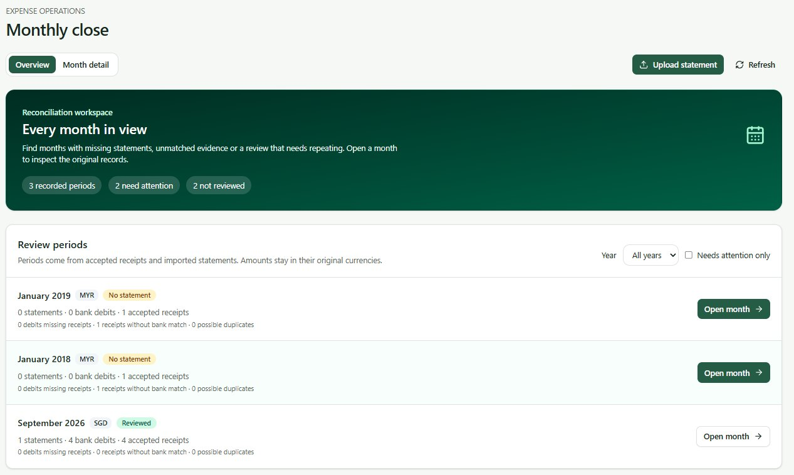

*Monthly Close overview after the September review is recorded*

September now displays **Reviewed**. The two older MYR periods still need attention because they have accepted receipts but no statements: reviewing September does not clear unrelated months.

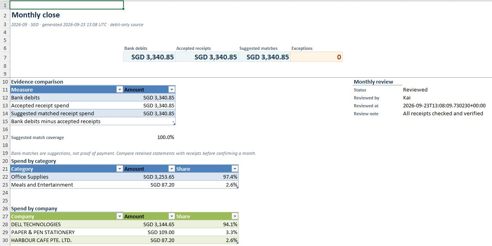

*Excel Monthly close summary sheet after the September review*

**Export month** downloads a workbook for the whole selected month and currency, including Summary, Bank transactions, Receipts, Statement sources and Payment audit. In the summary, **Suggested matches** are reconciliation hints, not proof of payment. The export’s reviewer and review status are a snapshot when generated, and evidence-list filters do not limit its rows.

## Complete screenshot inventory

All 39 images shown in this guide are stored in [`assets/screenshots/2026-09-23`](assets/screenshots/2026-09-23/). Images explicitly described as earlier examples came from separate demo runs. The previous screenshot set remains in [`assets/screenshots`](assets/screenshots/) for historical reference; this guide no longer uses it.

## Interpretation limits

- AI agents extract, recommend or explain; they do not approve, pay or post.
- PDF parsing is layout-dependent. Use normalized CSV when a bank PDF cannot be validated safely.
- Optional AI statement extraction requires consent; an invalid deterministic preview does not currently trigger an automatic AI retry.
- `No Bank Match` is an exception signal, not a payable determination.
- Screenshots include separate demo runs and different points in a workflow; compare values only within the example explicitly identified in its caption.
